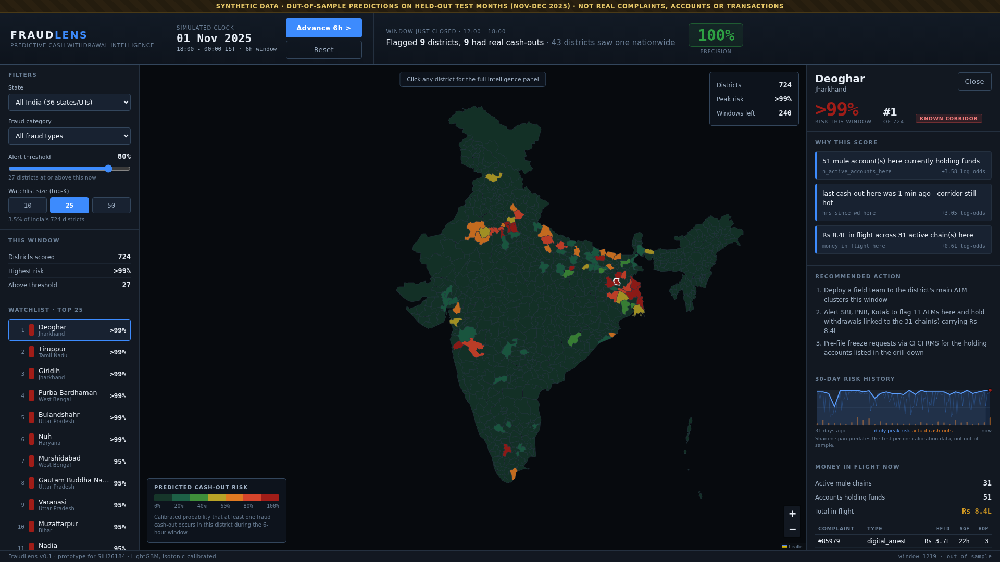
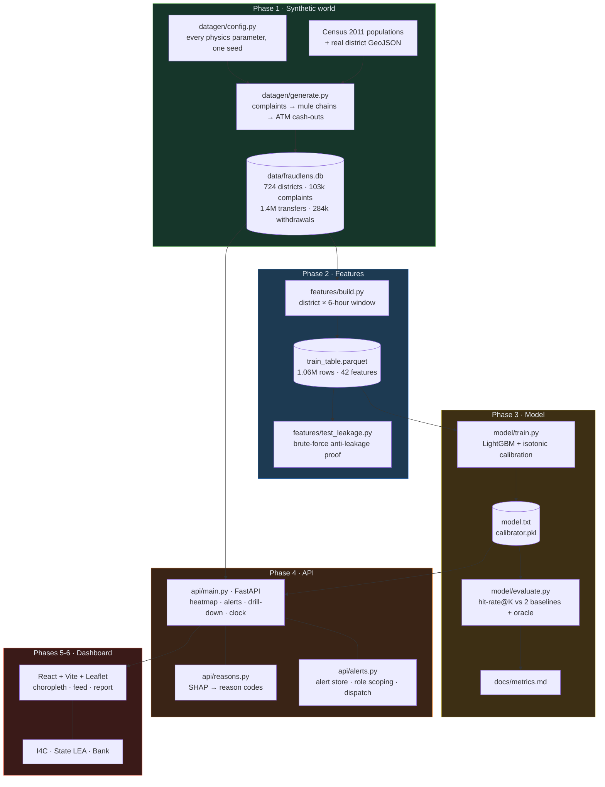

# FraudLens

**Predictive cash-withdrawal intelligence for cyber-fraud response.**
Smart India Hackathon problem statement **SIH26184**.

When someone is defrauded online, the money does not vanish. It moves through a
chain of mule accounts for a few hours and is then withdrawn as cash from an
ATM, usually 2 to 48 hours after the fraud, in a district far from the victim.
That gap is the only window in which anyone can intervene. FraudLens predicts
**which districts will see fraud cash-outs in the next 6 hours**, ranks them so
a limited number of teams can be deployed where they matter, and explains every
prediction in language an officer can act on. On held-out months, watching the
25 riskiest districts each window catches **56.7%** of the districts that
actually had a cash-out, against 21.6% for a static hotspot watchlist.

> **All data in this repository is synthetic.** Every metric below is measured
> on a simulated world and validates the pipeline, not real-world accuracy.
> See [Limitations](#limitations).

---

## Screenshots

**National view.** India by predicted cash-out risk for the current 6-hour
window. Advancing the clock also grades the window that just closed against
ground truth, so the demo verifies itself as it runs.



**State LEA with cross-jurisdiction referrals.** A state sees only its own
districts, plus the chains carrying money *out* of its jurisdiction: eleven
here, one landing in a West Bengal district our own model rates above 99%.


**Bank view.** No crime intelligence at all. Only this bank's ATMs in risk
districts and its own accounts holding funds, with freeze recommendations.


**Intelligence Report.** Any alert opens as a printable document
([sample PDF](docs/sample_intelligence_report.pdf)).


---

## Architecture



*(Exported as [docs/architecture.png](docs/architecture.png) for slides.)*

### How it fits together

**Phase 0 - setup.** Python 3.10 virtual environment, pinned requirements, repo
skeleton.

**Phase 1 - synthetic world** (`datagen/`). Real district geography from a
public GeoJSON and real Census-2011 populations, then a 12-month simulation
carrying the fraud physics that make this problem hard: mule chains 3-7 hops
deep with fan-out, cash-out 2-48 hours after the fraud split into withdrawals
under Rs 50,000, corridors that **drift monthly** as police pressure moves,
self-excitation where a cash-out raises the odds nearby for days, and diurnal
and weekly rhythms. Every parameter sits in one commented file behind one seed.

**Phase 2 - features** (`features/`). One row per (district, 6-hour window),
1.06M rows and 42 features. The rule that matters is anti-leakage: a feature may
only use events **visible** before the window opens, where a complaint becomes
visible when it is *reported* and a chain's transfers become visible only once
the complaint that traced them exists. `test_leakage.py` recomputes every
feature with a brute-force filter and asserts equality, then proves it would
catch a leak by shifting the cut-off.

**Phase 3 - model** (`model/`). LightGBM on a strictly temporal split, isotonic
calibration fitted only on a held-out validation slice, evaluated against two
baselines and an oracle with one shared scoring function.

**Phase 4 - API** (`api/`). FastAPI serving the calibrated model. Reason codes
come from the model's own per-row SHAP contributions, rendered with the row's
real values. The demo clock starts at the first test window and the API
**refuses** any earlier window, so nothing in-sample can ever be shown.

**Phase 5 - dashboard** (`dashboard/`). React, Vite and Leaflet console.

**Phase 6 - alerts and roles.** Alerts with acknowledge and dismiss, a
notification feed, mock SMS and email dispatch that shows the real message text,
three role-scoped views enforced server-side, and the printable Intelligence
Report.

**Phase 7 - this document,** the demo script, and a verified cold start.

---

## Results

Test months are November and December 2025, never touched until evaluation.
The metric is **hit-rate@K per 6-hour window**: of the districts that actually
had a fraud cash-out, how many were in our top K.

| K (share of India) | FraudLens | b2: trailing 7-day heat | b1: static 25 hotspots | Oracle |
|---|---|---|---|---|
| 10 (1.4%) | **26.7%** | 22.1% | 10.2% | 31.8% |
| 25 (3.5%) | **56.7%** | 53.7% | 21.6% | 73.4% |
| 50 (6.9%) | **80.3%** | 61.0% | 35.1% | 98.2% |

PR-AUC: **0.753** model, 0.503 trailing heat, 0.223 static list, 0.050 random.

**Reading these honestly.** An average window has 35.9 districts with a
cash-out, so 25 slots cannot cover them all: the oracle ceiling at K=25 is
73.4%, and the model reaches 77% of what is achievable. Against trailing heat
the K=25 margin is only 3.0 points, because recent history genuinely is
predictive. The model earns its keep in two other places:

- **Deeper in the list.** At K=50 the margin is 19.3 points, because live-chain
  features find districts with almost no recent history that are holding stolen
  money right now.
- **On new corridors.** Restricted to districts that only became hotspots during
  the test months, the model gets 63.7% against 45.9% for the static list.

The six live-chain features carry **60.8% of total model gain**. Removing them
costs only 0.8 points at K=25 but **12.6 points at K=50**, because what they
recover is the cold-start case: districts with roughly a handful of trailing
withdrawals against about 80 for a typical hit.

Full tables, calibration, drift-by-week and the ablation sweep are in
[docs/metrics.md](docs/metrics.md).

---

## How to run

Requires **Python 3.10+** and **Node 20+**. Everything runs locally on one
laptop; there are no cloud dependencies and no API keys.

### 1. Backend

```bash
git clone <this-repo> fraudlens && cd fraudlens

python3 -m venv venv
source venv/bin/activate
pip install -r requirements.txt

python -m datagen.generate       # ~45 s  → data/fraudlens.db
python -m features.build         # ~10 s  → data/train_table.parquet
python -m model.train            # ~25 s  → model/model.txt + calibrator
```

Optional but recommended, and fast:

```bash
python -m features.test_leakage  # ~20 s, must print LEAKAGE TEST PASSED
python -m model.evaluate         # ~5 s   → docs/metrics.md + charts
python -m datagen.validate       # physics checks + plots in docs/
pytest tests/                    # ~10 s, role-based data segregation proved over HTTP
```

Then start the API and leave it running:

```bash
uvicorn api.main:app --port 8000     # ~10 s to load; docs at /docs
```

### 2. Dashboard

In a second terminal. The dev server proxies `/api` to port 8000, so start the
backend first.

```bash
# only if node is not already on your PATH
export PATH=$HOME/.local/opt/node20/bin:$PATH

cd dashboard
npm install
npm run dev                          # http://localhost:5173
```

On Ubuntu 22.04, `apt install nodejs` may pull an old or slow third-party
package. Installing the official tarball avoids both and needs no root:

```bash
curl -fsSL -o /tmp/node.tar.xz https://nodejs.org/dist/v20.18.1/node-v20.18.1-linux-x64.tar.xz
mkdir -p ~/.local/opt && tar -xf /tmp/node.tar.xz -C ~/.local/opt
mv ~/.local/opt/node-v20.18.1-linux-x64 ~/.local/opt/node20
export PATH=$HOME/.local/opt/node20/bin:$PATH
```

### The SIH submission deck

```bash
python impact.py         # rupees and hours: docs/impact.md
python find_case.py      # the typical inter-state case on slide 5: docs/deck_case.json
python deck_charts.py    # the two deck charts
python build_deck.py     # -> build/FraudLens_SIH2026_PixelRex.pptx (from templates/sih2026_template.pptx)
python qa_geom.py        # geometry check, must print "issues: 0"
```

Every script runs from any working directory and writes only inside the repo. The
two dashboard screenshots the deck uses are regenerated with
`node dashboard/scripts/deck_screenshots.mjs` (API and dev server running).

### Reproducibility

Verified from a fresh clone: the pipeline regenerates the database, the feature
table and the model, and produces a **byte-identical `docs/metrics.md`**. One
seed in `datagen/config.py` drives the entire world.

---

## Limitations

Read this section before believing any number above.

**The data is synthetic.** No real complaint, account, transaction or withdrawal
appears anywhere in this repository. The generator encodes publicly documented
fraud behaviour, but a model trained on it has learned *our* simulation's
physics. The metrics prove the pipeline works end to end. They are **not**
evidence of real-world accuracy, and we do not claim they are.

**130 districts have estimated populations.** Our map has 724 districts; Census
2011 has 640. The 130 created after 2011 have no census row, so they receive a
share of their state's total. Each state is rescaled to its real census total,
so the national figure reconciles to 121.1 crore, but those individual district
populations are estimates rather than measurements.

**Alerts are in memory.** `POST /simulate/reset` clears them and a restart loses
them. A real deployment needs a persisted alert table with an immutable audit
trail of who was notified, who acknowledged, and what action followed. That is a
legal requirement we have not built.

**The drift cohorts are small.** The headline drift result rests on 6 districts
that became hotspots only during the test months, and 11 since training ended.
Those percentages are noisy and should not be quoted to three significant
figures.

**The margin over trailing heat at K=25 is modest.** Three points. A trailing
7-day heat map is a genuinely reasonable tool, and at the very top of the
ranking it is nearly as good. Our advantage is real but concentrated deeper in
the list and on newly emerging corridors, not at K=10.

**The model is not per-category.** Risk is a single number per district-window.
The fraud-category filter narrows *which* districts are displayed to those
holding money from that fraud type; it never re-ranks. A UPI-specific and a
digital-arrest-specific risk surface would be different models.

**Mock auth.** The role switcher demonstrates real server-side data
segregation, but nothing authenticates the claimed role. Production needs
identity, and the segregation logic then enforces against a verified principal.

**Other simplifications.** Neighbours are the 5 nearest district centroids, not
true shared borders. Each complaint spawns its own chain, whereas real gangs
reuse mule accounts across many victims. Chain hops become visible the instant a
complaint is reported, where real banks take hours to respond.

---

## Future work

**Spatio-temporal GNN (v2).** Districts form a graph and fraud spreads along it.
The current model sees neighbours through hand-built aggregates; an ST-GNN would
learn the propagation kernel directly and should improve exactly where we are
weakest, on corridors that have just started moving.

**Streaming ingestion.** The clock currently replays precomputed windows.
Real operation means consuming complaints and transaction trails as they arrive,
recomputing features incrementally, and rescoring continuously rather than every
six hours.

**Real CFCFRMS integration.** The pipeline is built to make this a data-source
swap rather than a rewrite. Feature construction already consumes a
complaint-and-transaction-trail shape, and the visibility rule already models
the fact that a trail only exists after a complaint is filed. What is needed is
the connector, the real bank-response delay, and re-tuning on real volumes.

**Online learning for adversarial drift.** Corridors move because the adversary
adapts, which makes this an adversarial problem, not a stationary one. A model
retrained on a fixed schedule is always behind. Continuous updating with
drift detection, plus monitoring for the feedback loop where enforcement in a
flagged district changes the very distribution being predicted, is the honest
version of this system.

**Persisted alerts and audit trail,** per the limitation above.

---

## Repository layout

```
PLAN.md              phase-by-phase build plan
datagen/             Phase 1: synthetic world (config, geo, population, generate, validate)
features/            Phase 2: feature pipeline + brute-force leakage test
model/               Phase 3: training, calibration, evaluation
api/                 Phase 4/6: FastAPI, reason codes, alert engine and role scoping
dashboard/           Phase 5/6: React + Vite + Leaflet console
docs/                phase notes, metrics, charts, screenshots, demo script
data/                generated artifacts (gitignored) + committed GeoJSON and census CSV
```

Per-phase design notes, decisions and judge Q&As live in `docs/phase1_notes.md`
through `docs/phase7_notes.md`. The 3-minute walkthrough is
[docs/demo_script.md](docs/demo_script.md).

## Data sources

- District boundaries: public India districts GeoJSON curated by
  [udit-001/india-maps-data](https://github.com/udit-001/india-maps-data).
  A cleaned copy carrying our `district_id` is committed.
- District population: **Census 2011**, joined by district name in
  `datagen/population.py`.
- Everything else is generated. No real personal or transaction data is used.
