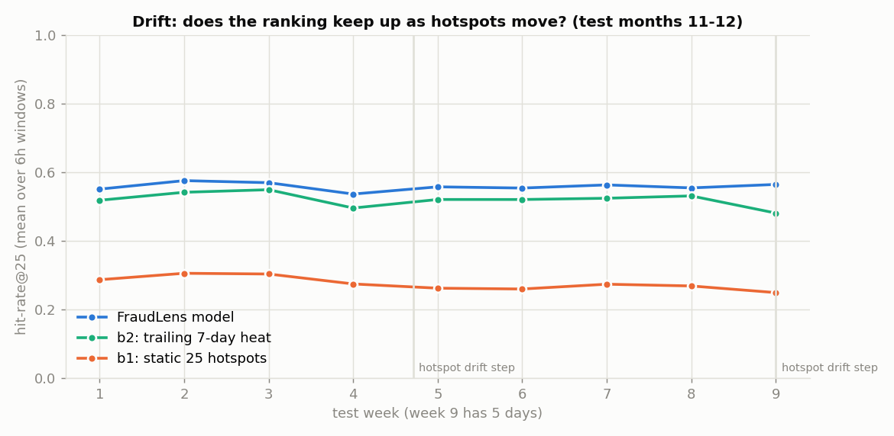
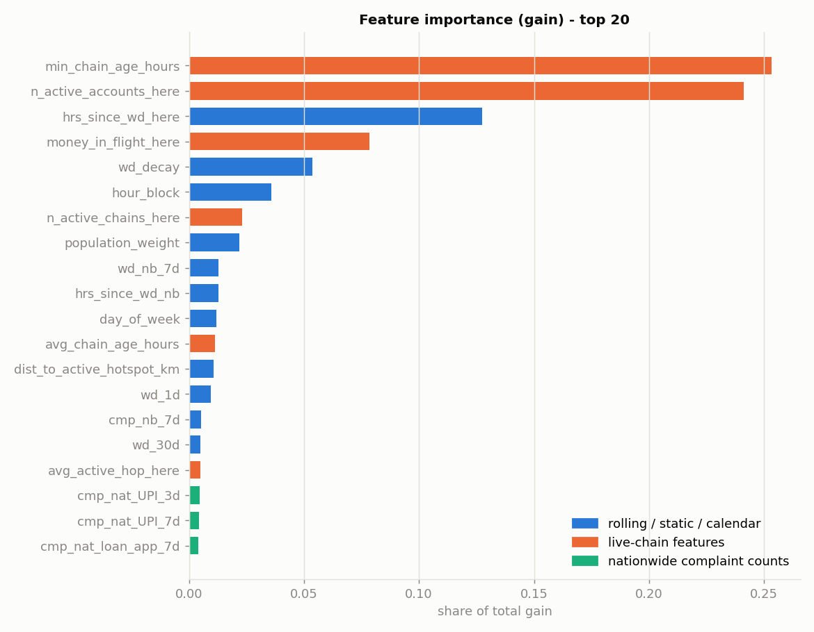

# Metrics (test months 11-12, synthetic data)

> All numbers are measured on the synthetic world from `datagen/`. They show the
> pipeline learns the encoded fraud physics; they are NOT claims about real-world accuracy.

## Setup

- train: 819,568 rows, 2025-01-01 to 2025-10-10, 5.03% positive
- validation (early stopping + isotonic calibration only): 60,816 rows, 2025-10-11 to 2025-10-31
- test (untouched until this script): 176,656 rows = 244 windows x 724 districts, 2025-11-01 to 2025-12-31, 5.04% positive
- positives per test window: mean 36.5 districts (so hit-rate@25 cannot reach 100% - see the oracle row)
- model: LightGBM, 326 trees (early-stopped), scale_pos_weight, 42 features; ablation: 287 trees, 36 features
- rankings use the raw model score; calibrated probabilities (isotonic, fit on validation) are reported below

## Headline: hit-rate@top-K per 6-hour window

"If police watch the K riskiest districts each window, what fraction of the districts
that actually had a fraud cash-out do we catch?" Precision@K = fraction of flagged
districts that had one; withdrawal coverage = share of individual withdrawals inside
flagged districts. Averaged over test windows with at least one cash-out.

### K = 10  (watching 10/724 = 1.4% of India's districts)

| label | hit_rate | precision | withdrawal_coverage |
|---|---|---|---|
| FraudLens model | 26.0% | 87.1% | 40.6% |
| model without live-chain features | 24.7% | 83.2% | 37.8% |
| b2: trailing 7-day heat | 21.8% | 75.0% | 28.6% |
| b1: static 25 hotspots | 11.5% | 40.3% | 14.7% |
| oracle (perfect ranking) | 31.6% | 100.0% | 67.2% |

### K = 25  (watching 25/724 = 3.5% of India's districts)

| label | hit_rate | precision | withdrawal_coverage |
|---|---|---|---|
| FraudLens model | 55.8% | 76.7% | 73.3% |
| model without live-chain features | 54.9% | 75.6% | 72.0% |
| b2: trailing 7-day heat | 52.2% | 72.6% | 67.8% |
| b1: static 25 hotspots | 27.7% | 38.7% | 35.5% |
| oracle (perfect ranking) | 73.1% | 96.1% | 93.2% |

### K = 50  (watching 50/724 = 6.9% of India's districts)

| label | hit_rate | precision | withdrawal_coverage |
|---|---|---|---|
| FraudLens model | 78.9% | 56.1% | 88.4% |
| model without live-chain features | 65.9% | 46.0% | 80.4% |
| b2: trailing 7-day heat | 59.0% | 41.4% | 73.0% |
| b1: static 25 hotspots | 36.6% | 25.9% | 44.2% |
| oracle (perfect ranking) | 97.6% | 69.9% | 99.6% |

## PR-AUC (test)

| method | pr_auc |
|---|---|
| FraudLens model | 0.741 |
| model without live-chain features | 0.621 |
| b2: trailing 7-day heat | 0.477 |
| b1: static 25 hotspots | 0.223 |

Random ranking would score 0.050.

## Calibration (isotonic, fitted on the validation slice only)

- Brier score on test: raw 0.0584 -> calibrated 0.0221 (lower is better; scale_pos_weight inflates raw scores)

| bin | n | mean_predicted | observed |
|---|---|---|---|
| 0.0-0.1 | 161500 | 0.009 | 0.009 |
| 0.1-0.2 | 3483 | 0.127 | 0.131 |
| 0.2-0.3 | 2771 | 0.247 | 0.273 |
| 0.3-0.4 | 1074 | 0.379 | 0.389 |
| 0.4-0.5 | 1284 | 0.461 | 0.419 |
| 0.5-0.6 | 862 | 0.570 | 0.564 |
| 0.6-0.7 | 1032 | 0.632 | 0.675 |
| 0.7-0.8 | 1354 | 0.745 | 0.783 |
| 0.8-0.9 | 2104 | 0.849 | 0.875 |
| 0.9-1.0 | 1192 | 0.956 | 0.967 |

## Drift analysis

hit-rate@25 per test week (hotspots are reshuffled by the generator every 30 days):

| week | days | model | ablation | b2 | b1 |
|---|---|---|---|---|---|
| 1 | 7 | 55.1% | 54.7% | 51.9% | 28.7% |
| 2 | 7 | 57.6% | 56.4% | 54.2% | 30.6% |
| 3 | 7 | 57.0% | 56.9% | 54.9% | 30.4% |
| 4 | 7 | 53.7% | 53.5% | 49.6% | 27.5% |
| 5 | 7 | 55.8% | 55.0% | 52.1% | 26.2% |
| 6 | 7 | 55.4% | 53.4% | 52.1% | 26.0% |
| 7 | 7 | 56.3% | 54.9% | 52.4% | 27.4% |
| 8 | 7 | 55.5% | 54.7% | 53.1% | 26.9% |
| 9 | 5 | 56.5% | 54.7% | 48.1% | 25.0% |

### Cash-outs in districts that were never hot during training

hit-rate@25 restricted to positives in districts whose first hotspot episode started
after the training rows end (day 283, 2025-10-10) or after the
test start (day 304, 2025-11-01). n_windows = test windows containing such a cash-out.

**new since training rows ended** - 10 districts: 230 (day 330), 237 (day 360), 238 (day 300), 254 (day 360), 311 (day 330), 323 (day 330), 364 (day 360), 398 (day 300), 718 (day 330), 721 (day 300)

| method | hit_rate_25 | n_windows |
|---|---|---|
| FraudLens model | 87.0% | 241 |
| model without live-chain features | 80.7% | 241 |
| b2: trailing 7-day heat | 87.5% | 241 |
| b1: static 25 hotspots | 17.2% | 241 |

**new during test months only** - 7 districts: 230 (day 330), 237 (day 360), 254 (day 360), 311 (day 330), 323 (day 330), 364 (day 360), 718 (day 330)

| method | hit_rate_25 | n_windows |
|---|---|---|
| FraudLens model | 70.2% | 175 |
| model without live-chain features | 60.9% | 175 |
| b2: trailing 7-day heat | 64.2% | 175 |
| b1: static 25 hotspots | 0.0% | 175 |

## Feature importance (gain)

| rank | feature | gain_share | group |
|---|---|---|---|
| 1 | min_chain_age_hours | 25.3% | live chain |
| 2 | n_active_accounts_here | 24.1% | live chain |
| 3 | hrs_since_wd_here | 12.8% | other |
| 4 | money_in_flight_here | 7.8% | live chain |
| 5 | wd_decay | 5.4% | other |
| 6 | hour_block | 3.6% | other |
| 7 | n_active_chains_here | 2.3% | live chain |
| 8 | population_weight | 2.2% | other |
| 9 | wd_nb_7d | 1.3% | other |
| 10 | hrs_since_wd_nb | 1.3% | other |
| 11 | day_of_week | 1.2% | other |
| 12 | avg_chain_age_hours | 1.1% | live chain |
| 13 | dist_to_active_hotspot_km | 1.1% | other |
| 14 | wd_1d | 0.9% | other |
| 15 | cmp_nb_7d | 0.5% | other |
| 16 | wd_30d | 0.5% | other |
| 17 | avg_active_hop_here | 0.5% | live chain |
| 18 | cmp_nat_UPI_3d | 0.5% | nationwide complaints |
| 19 | cmp_nat_UPI_7d | 0.4% | nationwide complaints |
| 20 | cmp_nat_loan_app_7d | 0.4% | nationwide complaints |

- live-chain features: ranks min_chain_age_hours #1, n_active_accounts_here #2, money_in_flight_here #4, n_active_chains_here #7, avg_chain_age_hours #12, avg_active_hop_here #17 - together 61.2% of total gain
- nationwide complaint features (15): best rank #18, together 5.8% of total gain

## Ablation: remove the six live-chain features

Same recipe, same split, 36 features instead of 42.

| k | with_chains | without | delta |
|---|---|---|---|
| 10 | 26.0% | 24.7% | +1.3% |
| 25 | 55.8% | 54.9% | +0.9% |
| 50 | 78.9% | 65.9% | +13.0% |

PR-AUC with 0.741 vs without 0.621 (a large gap, while the
hit-rate gap at K=25 is small). The reason is that the benefit is concentrated deeper in
the ranking - sweeping K shows where it appears:

| k | model | ablation | delta | oracle |
|---|---|---|---|---|
| 5 | 13.8% | 13.4% | +0.4% | 15.8% |
| 10 | 26.0% | 24.7% | +1.3% | 31.6% |
| 25 | 55.8% | 54.9% | +0.9% | 73.1% |
| 40 | 71.5% | 63.8% | +7.7% | 93.1% |
| 50 | 78.9% | 65.9% | +13.0% | 97.6% |
| 75 | 85.7% | 69.9% | +15.8% | 100.0% |
| 100 | 88.2% | 73.2% | +15.0% | 100.0% |
| 150 | 91.2% | 77.5% | +13.6% | 100.0% |

At K=50 the full model catches 1,468 positive district-windows the ablation misses,
while the ablation catches 238 the full model misses. Those model-only catches are COLD
districts, not the obvious corridors:

| group | wd7 | chains |
|---|---|---|
| all positive district-windows | 79.723 | 12.370 |
| caught by model only (K=50) | 4.403 | 1.745 |

`wd7` = withdrawals in that district over the previous 7 days; `chains` = live chains holding
money there. The districts the live-chain features rescue have almost no recent history
(4.4 vs 79.7 trailing withdrawals), so no amount of trailing heat could rank them.
They are visible only because stolen money is sitting in their accounts right now. That is the
cold-start case the differentiator exists for.
