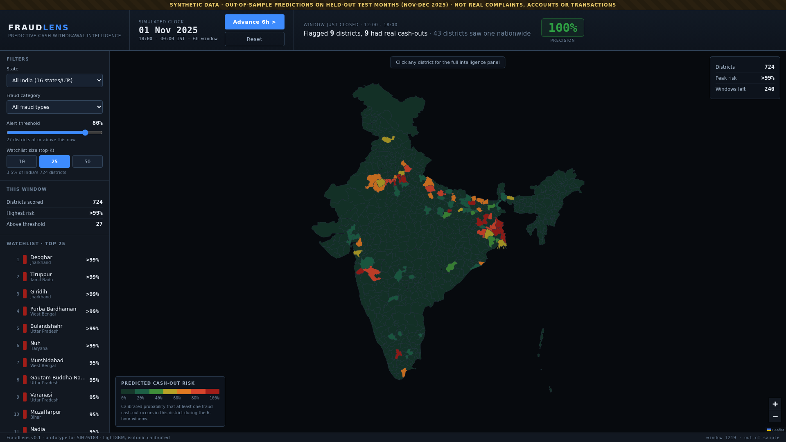
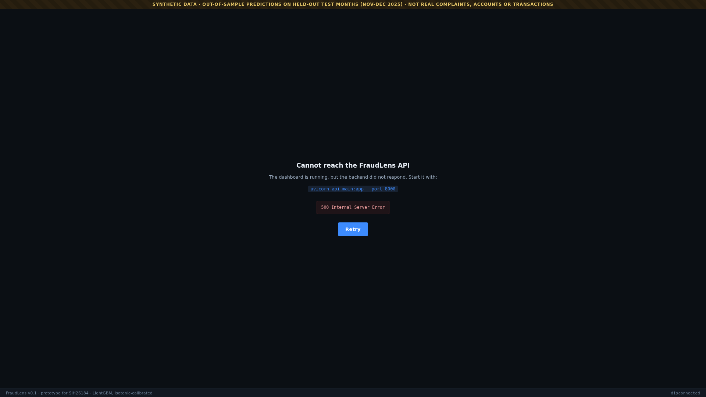

# Phase 5 notes - risk heatmap dashboard

## What was built

React + Vite + Leaflet console in `dashboard/`, talking to the Phase 4 API.

```bash
# terminal 1 (repo root)
source venv/bin/activate && uvicorn api.main:app --port 8000
# terminal 2
export PATH=$HOME/.local/opt/node20/bin:$PATH
cd dashboard && npm install && npm run dev      # http://localhost:5173
```




## Layout

- **Top bar** - simulated clock, `Advance 6h` and `Reset`, and the self-grading
  result of the window that just closed. That result is the demo centrepiece:
  it flashes on update and shows a large precision figure, colour-coded green
  above 80%, amber above 50%, red below.
- **Left panel** - state, fraud category, alert-threshold slider, top-K selector
  (10/25/50 with the matching share of India's 724 districts), a live count of
  districts above the threshold, and the ranked watchlist.
- **Map** - full-bleed district choropleth, hover tooltip, click to drill down,
  legend bottom-left, window statistics top-right.
- **Right panel (on click)** - name and state, risk and rank, known-corridor tag,
  reason codes as cards with their real feature name and log-odds contribution,
  the recommended actions, a 30-day sparkline, live chains with money in flight,
  recent cash-outs and complaints, and ATM coverage by bank.
- **Banner and footer** - the synthetic-data warning is a permanent top banner,
  and the footer carries the current window index and its out-of-sample status.

## Three design decisions worth defending

**The risk ramp is deliberately dark at the bottom.** Only about 5% of
district-windows contain a cash-out, so a literal green-to-red ramp painted
nine tenths of India a vivid green and buried the signal. Near-zero risk is now
a dark, desaturated green that recedes into the map, and the ramp opens up into
green, amber and red where there is actual signal. Same ramp the brief asked
for; the low end just stops shouting.

**The dashboard never displays "100% risk".** Isotonic calibration clips its top
bin to exactly 1.0, and the API returns that faithfully. Printing it would claim
a certainty the model does not have - on the test months that top bin fires
about 97% of the time. So `riskLabel()` renders anything at or above 0.995 as
`>99%`, and anything in (0, 0.005) as `<1%`.

**The sparkline shows daily peaks over the raw series.** Thirty days of 6-hour
windows is 120 points in a 340px panel, which rendered as an unreadable
scribble. The bold line is now the daily peak, with the raw 6-hour series faint
behind it, and orange base ticks for cash-outs that actually happened. Any part
of the history that predates the test period is shaded, because the sparkline is
the one place the UI reaches back into the calibration window.

## Error handling

Three layers, all exercised:

1. `api.js` converts every fetch failure and non-2xx response into an `Error`
   with a readable message, so no raw rejection reaches a component.
2. `App.jsx` renders a full-page recovery screen if the initial load fails, and
   an inline error strip for later failures, keeping the rest of the UI usable.
3. `ErrorBoundary` catches any render-time exception so React never shows a
   blank white page.

Verified by killing the API and reloading:



The synthetic-data banner survives, the user is told exactly which command to
run, and a Retry button reloads.

## API additions this phase needed

- `GET /geojson/districts` - serves the district polygons, so the 955 KB map
  lives in one place in the repo instead of being duplicated into the frontend.
- `GET /states` - the state filter's dropdown.
- `fraud_category` parameter on `/heatmap` - keeps districts currently holding
  money from that fraud type. The model is not per-category, so this narrows
  which districts are shown and never changes a score; the UI says so in the
  filter panel.

## Known limitations

- The map re-styles 724 polygons on every window change. It is smooth at 1080p
  on this laptop, but a much denser map would want a canvas renderer keyed on
  district id.
- The category filter cannot re-rank, only narrow. A per-category model is a
  Phase 7 idea, not a quick fix.
- No auth or roles yet - that is Phase 6.
- Node had to be installed as a local tarball at `~/.local/opt/node20` because
  apt hung on a third-party repo. Nothing in the project depends on that path
  beyond it being on `PATH`.

## Judge Q&As

**Q: Is this showing live predictions, or a recorded animation?**
A: Live. Every advance posts to the API, which scores the next 6-hour window and
returns both the new risk surface and a grade for the window that just closed.
You can move the threshold slider or switch states at any point and the numbers
recompute against the same model. The clock cannot be moved before 1 November
2025, because the API refuses to serve any window from the training period.

**Q: The top districts all show ">99%". Is the model just saturating?**
A: Partly, and the display is honest about it. Those are calibrated
probabilities, and isotonic regression assigns its top bin a value of 1.0, which
we render as ">99%" rather than "100%". On the held-out months that bin does
fire about 97% of the time, so a near-certain reading is earned rather than
invented. The thing to watch on the projector is the precision figure in the top
bar, which grades those confident calls against what actually happened.

**Q: Why does the whole map look calm when fraud is everywhere?**
A: Because on any given 6-hour window it genuinely is calm almost everywhere -
about 5% of districts see a fraud cash-out. That is the entire operational
point: a police force cannot watch 724 districts, so the product's job is to say
which 25 to watch tonight. A map that lit up everywhere would be useless.
