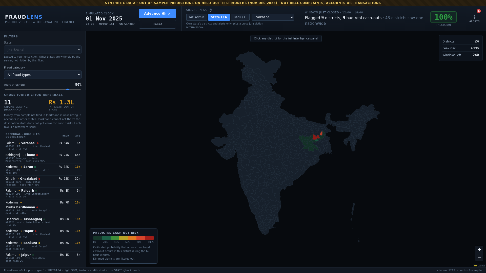
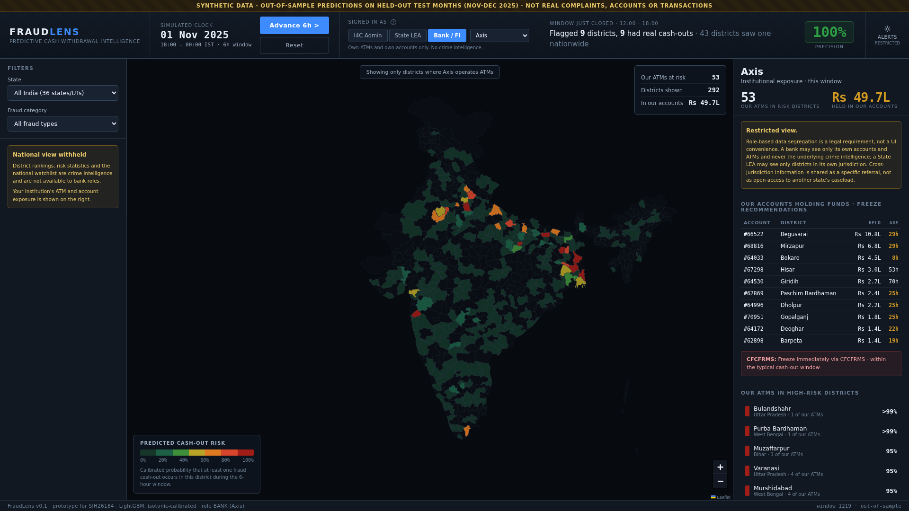
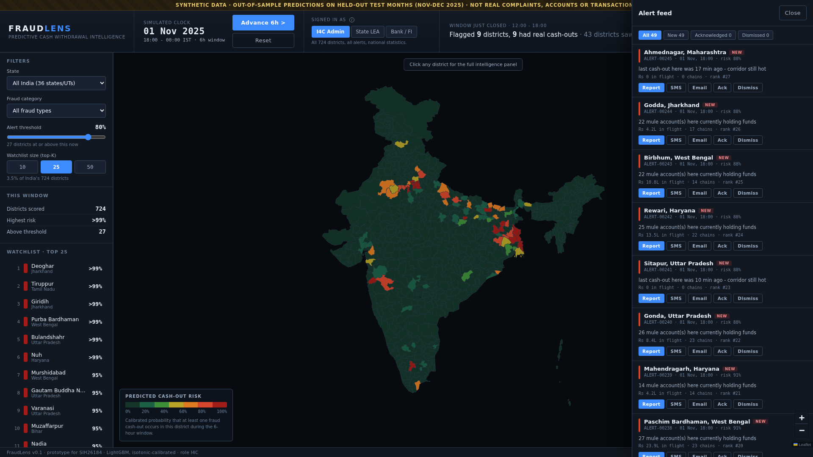
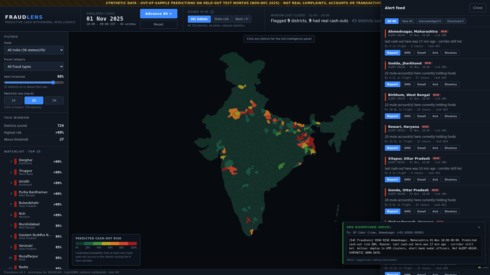
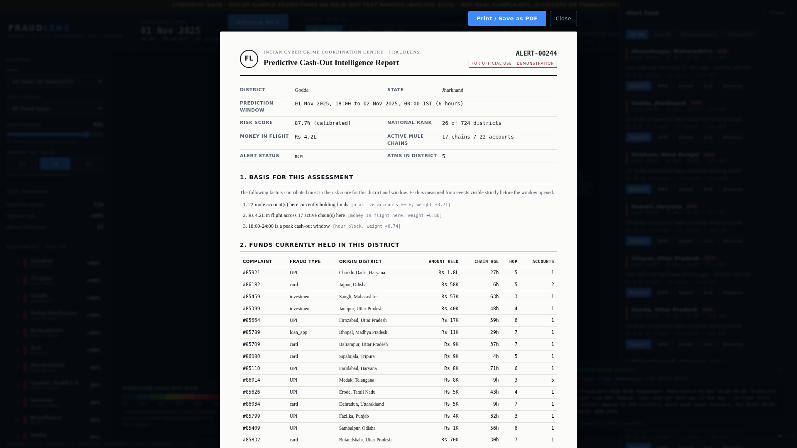

# Phase 6 notes - alerts, roles and the intelligence report

## What was built

- `api/alerts.py` - alert store, role scoping, dispatch message templates,
  cross-jurisdiction referrals, and the bank exposure view
- API endpoints: `/roles`, `/feed`, `/feed/{id}/status`, `/feed/{id}/dispatch`,
  `/feed/{id}/report`, `/cross-jurisdiction`, `/bank/exposure`
- Dashboard: role switcher, notification bell and feed drawer, dispatch toasts,
  printable Intelligence Report, cross-jurisdiction inbox, bank panel

One data-model change was needed: `accounts` now carries a `bank`, because a
bank-facing view has to show an institution only its own accounts. It is drawn
from a **separate RNG stream** (`SEED + 1`) so the rest of the world is
untouched - the regenerated feature table is byte-identical to the one Phase 3
trained on, so no metric moved.

## Role-based data segregation

Scoping happens on the server, in `alerts.py`, not in the UI. A bank response
physically does not contain crime intelligence.

| Role | Sees | Does not see |
|---|---|---|
| **I4C Admin** | all 724 districts, every alert, national statistics | - |
| **State LEA** | own state's districts and alerts, cross-jurisdiction inbox | other states' districts, alerts or caseload |
| **Bank / FI** | own ATMs in risk districts, own accounts holding funds, CFCFRMS freeze recommendations | alerts, reason codes, complaints, chains, district rankings, national statistics |

The reason is stated in a tooltip on the role switcher and repeated in the
restricted panels:

> Role-based data segregation is a legal requirement, not a UI convenience. A
> bank may see only its own accounts and ATMs and never the underlying crime
> intelligence; a State LEA may see only districts in its own jurisdiction.
> Cross-jurisdiction information is shared as a specific referral, not as open
> access to another state's caseload.



For a State LEA the map dims every other state, the state filter is locked with
an explanation, and the feed carries a "JHARKHAND ONLY" chip - 6 alerts where
I4C sees 49.



For a bank the left panel's national watchlist is replaced by a "National view
withheld" notice, the map shows **only districts where that bank operates
ATMs**, and the bell reads "restricted". Opening the feed explains why rather
than showing an empty list.

## Cross-jurisdiction inbox - the coordination story

This is the gap the problem statement describes. A complaint is filed in one
state; the money is already sitting in a mule account in another. The origin
state cannot act there, and the destination state does not know the case exists.

The inbox lists, for the signed-in state, every active chain whose complaint was
filed there but whose money is now held elsewhere: origin district, destination
district and state, amount held, chain age, and the destination's own predicted
risk. Clicking a row jumps the map to the destination district.

In the screenshot above, Jharkhand has 11 chains carrying Rs 1.3L out of state,
including Koderma to Purba Bardhaman in West Bengal where the destination
district is itself at >99% risk. That is a referral worth sending today.

## Alert engine

Advancing the clock creates one alert per district crossing the threshold,
carrying the model's own reason codes and recommended actions. Status moves
`new -> acknowledged | dismissed`; the bell shows the unread count, and the feed
filters by status.



## Mock dispatch

`POST /feed/{id}/dispatch?channel=sms|email` builds the message, logs it
server-side and returns it. Nothing is transmitted. The dashboard toasts the
**full message body**, because the point is for a judge to read what an officer
actually receives:



```
[I4C FraudLens] HIGH RISK Godda, Jharkhand 01-Nov 18:00-00:00. Predicted
cash-out risk 88%. 17 mule chain(s) holding Rs 4.2L here. Reason: 22 mule
account(s) here currently holding funds. Action: deploy to ATM clusters,
alert bank nodal officers. Ref ALERT-00097. SYNTHETIC DEMO DATA.
```

Plenty of alerts fire on recent cash-out activity with no money currently parked
in the district. The first draft rendered those as "0 mule chain(s) holding
Rs 0", which reads as a bug on a phone, so that clause is now omitted and the
email says "none currently parked here - alert is driven by recent cash-out
activity" instead.

## Intelligence Report (deliverable c)



Click any alert to open a document-styled report: reference number, district and
window, risk and rank, numbered evidence findings each showing the feature and
its weight, the funds-held table, ATMs to be covered, recommended actions, a
dispatch log, and a footer with the synthetic-data stamp, model version and
generation timestamp.

The chains table is quietly the most persuasive part: for Godda it lists money
originating from Haryana, Odisha, Maharashtra, Uttar Pradesh, Madhya Pradesh,
Tripura, Telangana, Tamil Nadu, Uttarakhand and Punjab - ten states feeding one
district's ATMs, on one page.

Print CSS is real, not decorative. `docs/sample_intelligence_report.pdf` is a
2-page A4 PDF produced by Chrome's print path with all dashboard chrome removed.

## Known limitations

- Alerts live in memory and are cleared by `POST /simulate/reset`. A real
  deployment needs a table and an audit trail.
- The role switcher is mock auth. The segregation it demonstrates is real
  (server-side), but nothing authenticates the claimed role.
- Recommended actions and freeze recommendations are rules over the model's
  numbers, not a learned policy.
- Dispatch is logged, never sent. No SMS gateway or SMTP is configured, by design.

## Judge Q&As

**Q: Is the role switch just hiding things in the browser?**
A: No. The scoping is in `api/alerts.py` and runs before the response is built.
A bank request returns no alerts, no reason codes and no district rankings at
all, so there is nothing in the payload to un-hide. You can confirm it with
curl: `/feed?role=BANK&bank=SBI` returns an empty list and a note saying alerts
are crime intelligence. That matters because in a real deployment the bank is a
different organisation, and the segregation has to survive someone opening dev
tools.

**Q: Why does a bank get an instruction rather than the reasoning?**
A: Because it needs to act, not to investigate, and because the reasoning
contains other people's case data. A bank is told which of its own ATMs sit in
high-risk districts and which of its own accounts are holding funds that are
about to be withdrawn, with a CFCFRMS freeze recommendation keyed to the chain
age. That is everything required to act, and nothing about the victims, the
complaints or the other banks in the chain.

**Q: What makes the cross-jurisdiction inbox more than a filter?**
A: It inverts the question. Every other view asks "what is about to happen in my
district?" The inbox asks "whose money that I am responsible for is about to be
withdrawn somewhere I have no authority?" Those are different rows in the
database and different phone calls. In the demo Jharkhand is carrying eleven
outbound chains, one of them into a West Bengal district our own model rates
above 99% for the next six hours. Without that view, the Jharkhand officer would
never look at West Bengal, and the West Bengal officer would have no idea a
Jharkhand case was landing on them.
